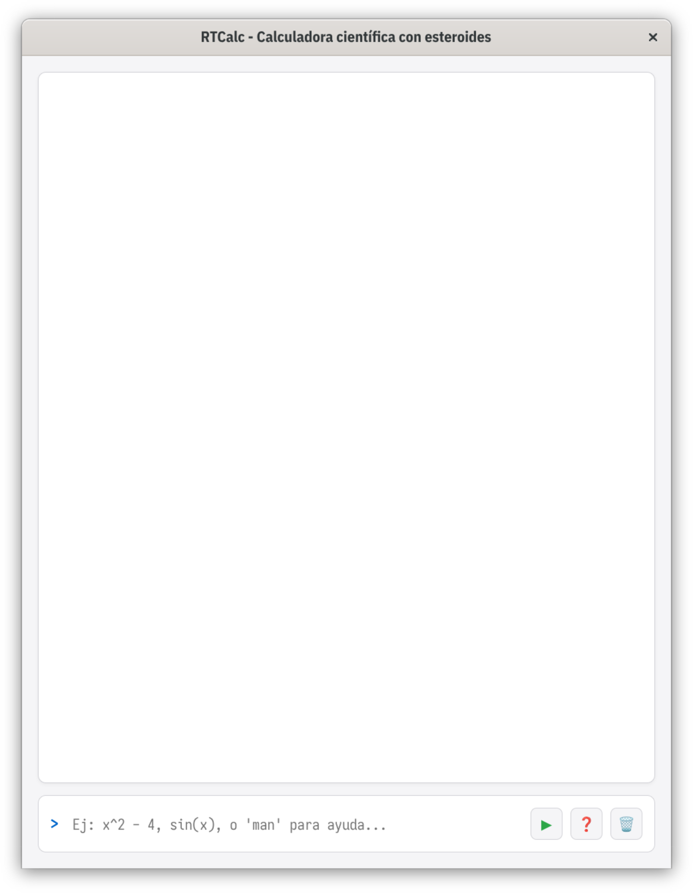
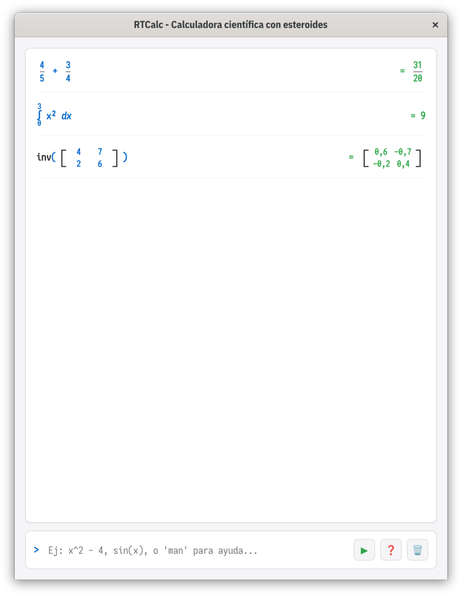
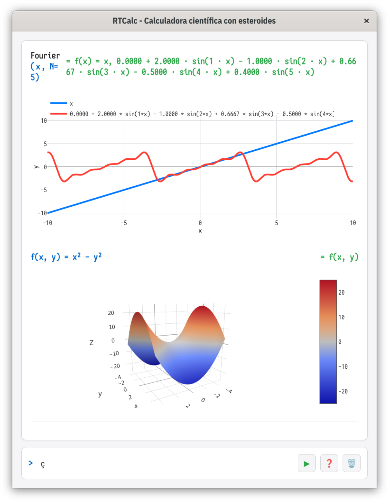
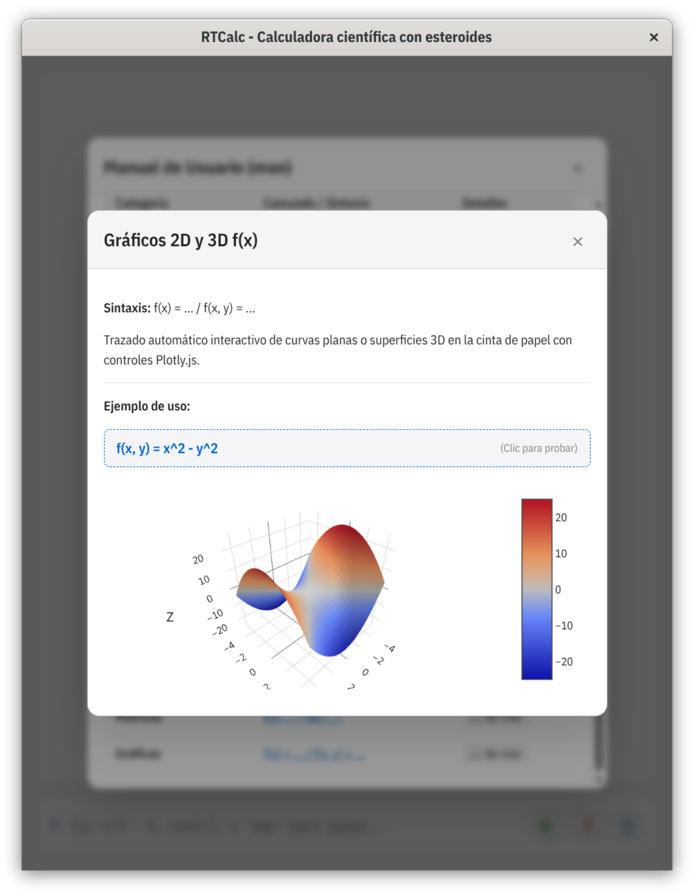

# RTCalc (Scientific Roller Tape Calculator)

**RTCalc** es una calculadora científica de escritorio desarrollada en Electron para entornos técnicos y educativos. Combina el flujo continuo de una **cinta de papel interactiva** con la potencia de un motor matemático analítico y numérico avanzado.

---

## 📸 Capturas de Pantalla

| Pantalla de Bienvenida | Cinta de Cálculo & Notación Tipográfica |
| :---: | :---: |
|  |  |

| Análisis de Fourier & Gráficos 2D/3D | Manual Interactivo en 2 Etapas (`man`) |
| :---: | :---: |
|  |  |

---

## 🚀 Características Principales

* **Cinta de Papel Interactiva:** Visualización de expresiones en formato de libro de texto (fracciones verticales, integrales con límites, derivadas analíticas, límites y matrices tipográficas).
* **Gráficos 2D y 3D Integrados:** Trazado de curvas planas y superficies tridimensionales mediante Plotly.js directamente sobre la cinta para funciones `f(x)` y `f(x, y)`.
* **Sistema de Ayuda Interactivo en 2 Etapas (`man`):** 
  * **Etapa 1:** Resumen de comandos organizados por categorías.
  * **Etapa 2:** Modal de documentación detallada con descripción teórica, ejemplo ejecutable al hacer clic y previsualización gráfica en vivo.
* **Tipografía Dual:**
  * **`IBM Plex Sans Condensed`:** Utilizada en toda la interfaz de usuario (modales, tablas, botones y encabezados).
  * **`Iosevka Charon Mono`:** Reservada para la cinta de resultados, el prompt y el campo de entrada.
* **Motor Matemático Extendido (`mathjs` + `customScope`):**
  * **Aritmética Exacta:** Simplificación y representación de fracciones exactas.
  * **Álgebra:** Factorización automática (factor común, por grupos, diferencia de cuadrados y trinomios).
  * **Matemática Discreta:** MCD, MCM, descomposición en factores primos (`factors(n)`) y congruencia modular ($a \equiv b \pmod m$).
  * **Ecuaciones:** Solución de sistemas lineales ($ax+b=c$), cuadráticos (raíces reales o complejas) y diofánticos ($ax+by=c$).
  * **Cálculo Infinitesimal:** Derivada analítica, integral definida numérica (regla de Simpson) y límites laterales.
  * **Transformadas & Series:** Transformada de Laplace ($\mathcal{L}$) y análisis/reconstrucción armónica por Serie de Fourier.
  * **Álgebra Lineal:** Operaciones matriciales con renderizado de corchetes (determinantes, inversas y transpuestas).

---

## ⌨️ Comandos y Sintaxis Destacados

| Categoría | Comando / Ejemplo | Descripción |
| :--- | :--- | :--- |
| **Aritmética** | `4/5 + 3/4` | Operaciones con fracciones exactas ($\frac{31}{20}$) |
| **Factoreo** | `factor('x^2 - 9')` | Factorización simbólica de expresiones |
| **Primos** | `factors(360)` | Descomposición en producto de potencias de primos |
| **Congruencia** | `congruent(17, 5, 12)` | Evalúa la relación comparativa $a \equiv b \pmod m$ |
| **Cuadráticas** | `solveQuad(1, -5, 6)` | Raíces mediante la fórmula de Bhaskara |
| **Diofánticas** | `diophantine(35, 15, 50)` | Solución paramétrica entera $ax + by = c$ |
| **Cálculo** | `integral('x^2', 'x', 0, 3)` | Integral definida por método de Simpson |
| **Laplace** | `laplace('t^2')` | Transformada analítica $\mathcal{L}\{f(t)\}$ |
| **Fourier** | `fourier('x', 5)` | Reconstrucción y gráfico de los primeros $N$ armónicos |
| **Gráficos** | `f(x, y) = x^2 - y^2` | Generación de gráfico 3D en la cinta |

---

## 🛠️ Instalación y Desarrollo

### Requisitos previos
* Node.js (v16+)
* npm

### Pasos de instalación

1. **Clonar el repositorio:**
```bash
   git clone [https://github.com/pabloniklas/rtcalc-electron.git](https://github.com/pabloniklas/rtcalc-electron.git)
   cd rtcalc-electron

```

2. **Instalar dependencias:**
```bash
npm install

```


3. **Ejecutar en modo desarrollo:**
```bash
npm start

```


---

## 📦 Empaquetado (Build)

Para generar los paquetes ejecutables de distribución para Linux (`.AppImage`, `.deb`) o Windows (`.exe`):

```bash
npm run dist

```

Los ejecutables compilados se generarán dentro del directorio `dist/`.

---

## 📄 Licencia

Desarrollado por **Pablo Niklas** `<pablo.niklas@gmail.com>`.
MIT
